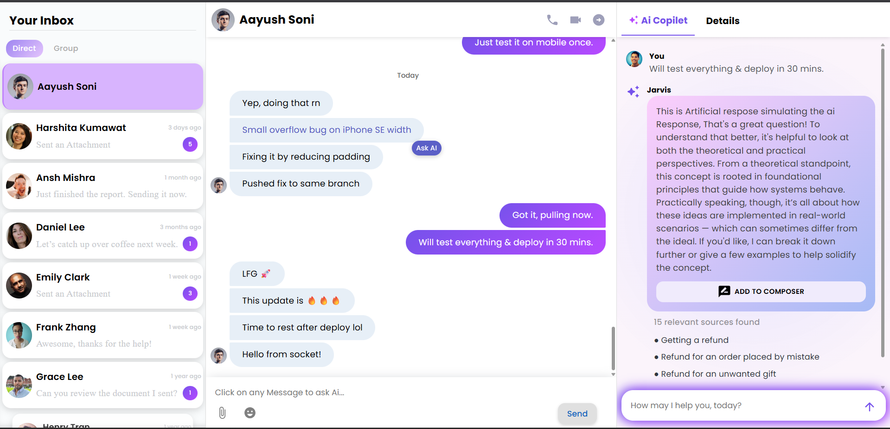

# 💬 BeyondChats

**BeyondChats** is a sleek, modern, and fully responsive real-time messaging UI built with **React**, **Material UI**, and **Framer Motion**. It features clean design, smooth animations, and intuitive interactions.

A key highlight is the **AI Copilot panel**—a static simulation of an AI assistant designed to showcase future AI-powered chat enhancements like smart suggestions and automated replies.

> **Note:** This is a front-end-only project using static sample data. Backend integration is planned.

---

## 📸 Preview

## 🚀 Live Demo

🌐 [View Live Demo](https://beyond-chat-ten.vercel.app/)

## 🌟 Features

- **Fully Responsive** — Optimized for all devices, including mobile (e.g., iPhone SE).
- **Chat Interface** — Intuitive message threads simulating real-time interaction.
- **Live UI Preview** — Simulated typing, message flow, and chat history.
- **AI Copilot Panel** — Static pane mimicking real-time AI chat behavior.
- **Mock Call Buttons** — Visual-only call buttons included for design demonstration.
- **Inbox Navigation** — Easy navigation through chat contacts and previews.
- **Modern UI/UX** — Clean, minimalistic design with smooth animations.

## 🧰 Tech Stack

- **React** — Component-based architecture for dynamic UI rendering.
- **Material UI** — Modern, responsive UI components and styling.
- **Framer Motion** — Fluid animations and transitions for a polished experience.

## 📁 Project Structure

- `Inbox Panel` – Displays list of direct and group conversations.
- `Chat Window` – Shows detailed conversation view with timestamped messages.
- `AI Copilot` – Static pane simulating AI response (styled and formatted).
- `Responsive Design` – Optimized layouts for both mobile and desktop.

## ⚙️ Limitations

- **No backend integration** — All content is static and meant for UI demo only.
- **Call buttons are non-functional** — Included for UI presentation purposes only.

## 👨‍💻 About the Developer

Hi! I'm **Aayush Soni**, a passionate web developer and student at the **Indian Institute of Information Technology (IIIT), Sri City**, currently pursuing a **B.Tech in Artificial Intelligence & Data Science (2023–2027)**.

BeyondChats is one of my UI-driven portfolio projects that showcases:

- Clean component structure
- Fully responsive design
- Smooth animations and modern layout

Connect with me:

- 🔗 [GitHub: @saffronAayush](https://github.com/saffronAayush)
- 🔗 [LinkedIn: @aayush-soni-dev](https://www.linkedin.com/in/aayush-soni-dev/)

## 📌 License

This project is licensed under the [MIT License](LICENSE).
